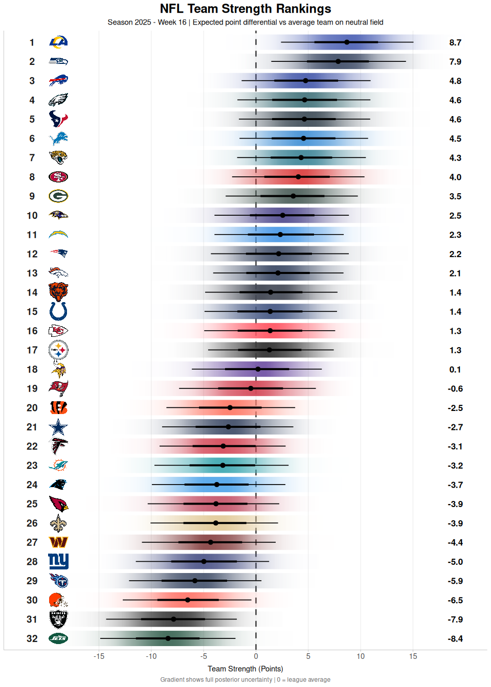
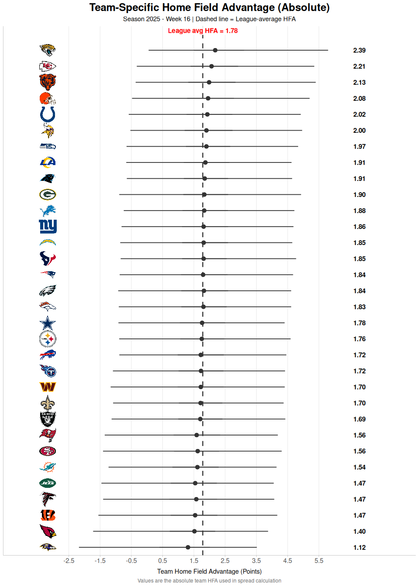
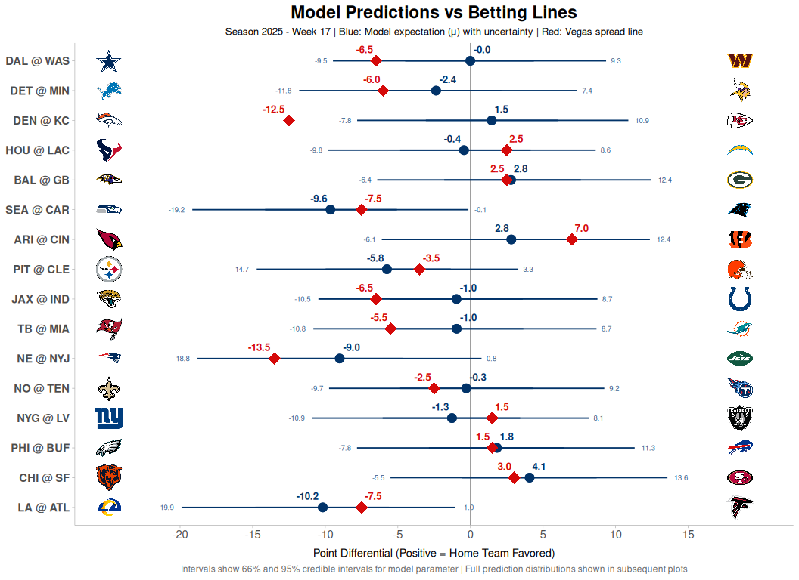
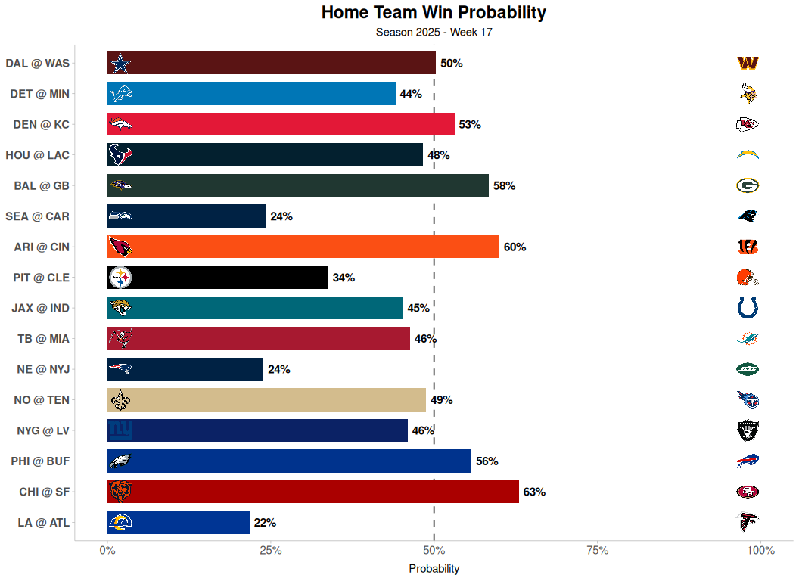
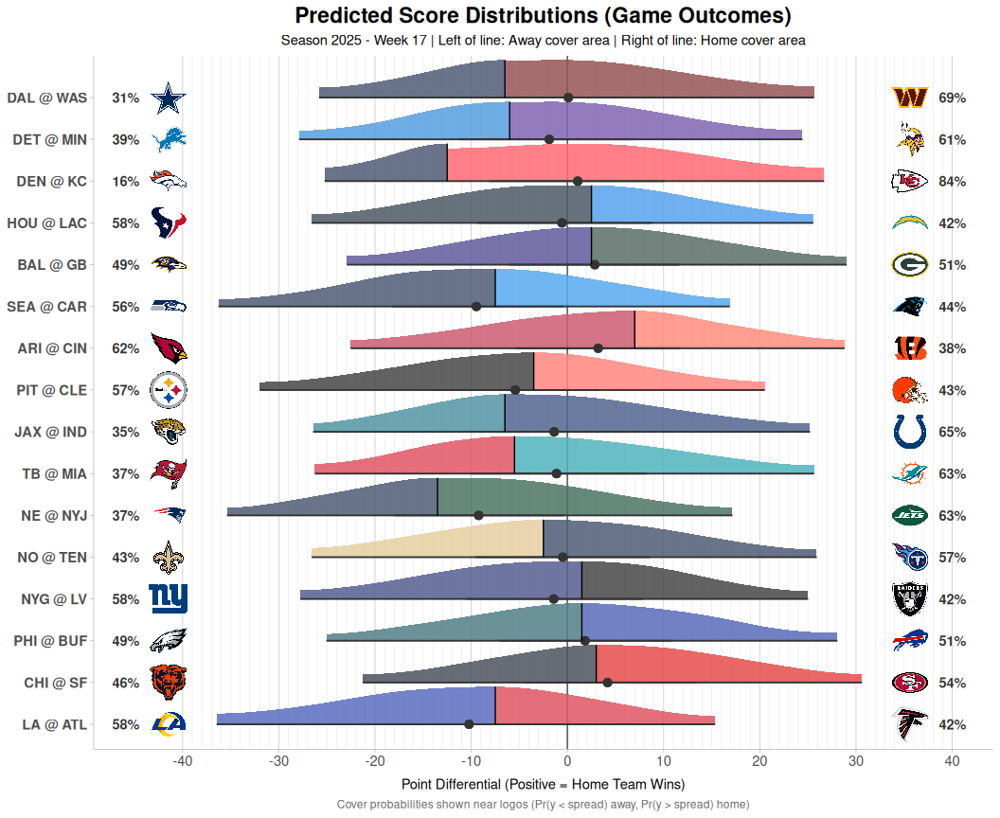
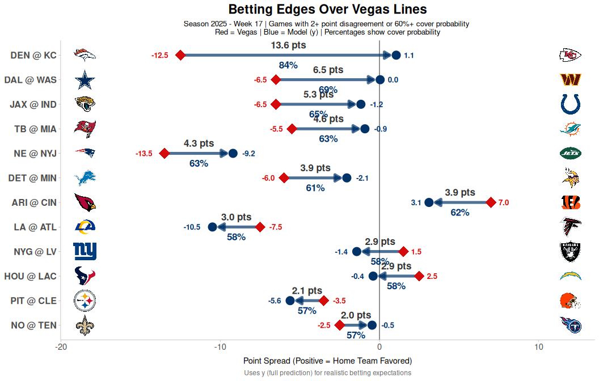

[View repository source ](){.btn .btn-secondary target="_blank"}

This draft post is based on `vignettes/weekly-report.qmd` in `nflendzonePipeline`. The goal is to keep one practical readout of what changed each week, why it changed, and what should be checked in model/app outputs next.

## Workflow At A Glance

```{mermaid}
flowchart LR
  A[nflverse raw data] --> B[nflendzonePipeline ETL + features]
  B --> C[nflendzoneData release tags]
  C --> D[weekly-report.qmd]
  D --> E[nflendzoneModel checks]
  D --> F[nflendzoneApp probability views]
```

## Core Steps Used In The Vignette

1. Load schedules, teams, and game history from `nflreadr`.
2. Pull latest `*_filter` and `*_predict` assets from `nflendzoneData` release tags.
3. Standardize variable names (`filtered_` and `predicted_` prefixes).
4. Render team strength, HFA, spread, win probability, score distribution, and betting-edge visuals.

## Source Snippet

```{r}
#| eval: false
# Function used in weekly-report.qmd
load_estimates_data <- function(tags, base_url) {
  timestamps <- purrr::map(
    tags,
    ~ jsonlite::fromJSON(
      paste0(base_url, .x, "/", .x, "_timestamp.json")
    )
  ) |>
    purrr::set_names(tags)

  purrr::imap(
    timestamps,
    ~ {
      season <- .x$season
      week <- .x$week
      data_url <- paste0(base_url, .y, "/", .y, "_", season, "_", week, ".rds")
      nflreadr::rds_from_url(data_url)
    }
  )
}
```

## Visual Output Set

### Team Strength Rankings

{fig-alt="Posterior team strength ranking plot with uncertainty intervals."}

### Team vs League Home Field Advantage

{fig-alt="Team-specific home field advantage differences against league baseline."}

### Spread Comparison

{fig-alt="Model spread estimates against market spread context."}

### Win Probability

{fig-alt="Game-level win probability estimates for the slate."}

### Score Distribution

{fig-alt="Joint score distribution output for selected matchups."}

### Betting Edge Summary

{fig-alt="Estimated model edge by market type and matchup."}

## Weekly Checklist I Use

- Confirm timestamp files and week/season labels match expected run window.
- Look for team-level movement with uncertainty widening, not just mean shifts.
- Flag sudden market-edge changes and trace them back to latent state movement.
- Hand off findings to model refresh and app QA.


