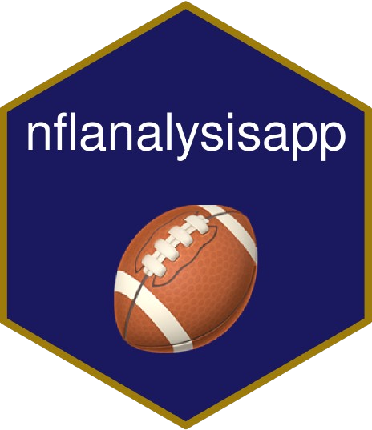

::: {.app-identity}

{.app-identity-icon fig-alt="NFL EndZone Analytics App icon"}

::: {.app-identity-body}

This app is the next generation of my NFL analytics work and **replaces** the earlier [NFL Analysis Dashboard](/projects/apps/nfl-analysis-app/).

::: {.app-actions}

[Launch dashboard   ](){.btn .btn-warning target="_blank"}
[View source code   ](){.btn .btn-info target="_blank"}

:::

:::

:::

*Actively in development: standings and game prediction modules are live, with additional features planned.*

Built with `Rhino`, `Shiny`, and `bslib`, the app combines NFL schedule/team data from `nflverse` with weekly model outputs from the companion [`nflendzoneData`](https://github.com/TylerPollard410/nflendzoneData) release assets.

📌 **Key highlights:**

- Interactive standings across Division, Conference, and League views, plus playoff seeding workflows powered by `nflseedR`.
- Game-level prediction workspace with adjustable spread and total sliders for selected matchups.
- Bayesian probability outputs for cover, total, and combined outcomes, including implied American odds.
- Multiple visualization modes for expected (`mu`) and simulated (`y`) outcomes in both result/total and home/away score spaces.
- Modular, production-oriented architecture using `Rhino` + `box`, deployed to Posit Connect Cloud.

## Technical Documentation

For full technical internals and system-level integration details:

- App architecture deep dive: [/projects/architecture/nflendzoneApp-architecture/](/projects/architecture/nflendzoneApp-architecture/)
- Ecosystem architecture (all four repos): [/projects/architecture/nfl-endzone-ecosystem/](/projects/architecture/nfl-endzone-ecosystem/)
